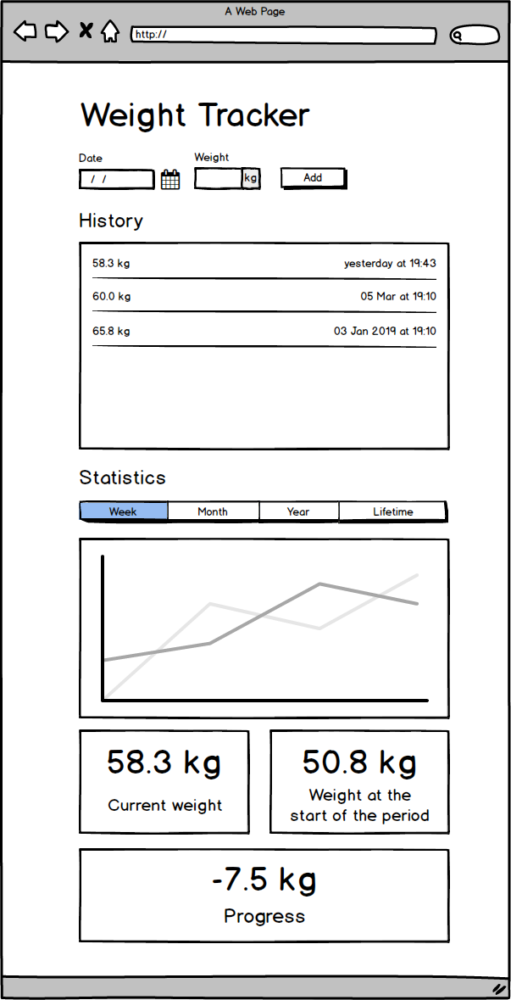

# Súly Napló
> Mini gyakorló projekt

Hozzátartozó magyarázó videó elérhető a YouTube-on: https://youtu.be/HmvjsJrx1N4

## Követelmények
- Űrlap: Adott időpontokhoz súly felvétele
- Napló: Az utolsó 10 felvitt adat megtekintése
- Statisztika
- Az adatokat tároljuk el a felhasználó gépére, tehát ha a felhasználó bezárja, és később megnyitja akkor legyenek újra elérhetőek az adatok

### Űrlap
- dátum és időpont mező kötelező
- súly mező kötelező
- dátum és időpont nem lehet a jövőben
- súlynak maximum 1 tizedesjegye lehet

### Napló
- az utolsó 10 felvitt adat megjelenítése
- súly megjelenítés formátuma: `xx.x kg`, példa: `62.0 kg`
- időpont megjelenítése
  - mai dátum esetén: `today at 17:12`
  - tegnapi dátum esetén: `yesterday at 17:12`
  - tegnap előtti dátum esetén: `01 Jan at 17:12`
  - nem ebben az évben készült dátum esetén: `01 Jan 2019 at 17:12`

### Statisztika
- Időszak választás
 - week: jelenlegi hét
 - month: jelenlegi hónap
 - year: jelenlegi év
 - lifetime: mindenkori
- Grafikon
 - a kiválasztott időszakról mutassa az adatokat
 - Y tengely: súly
   - ezen a tengelyen az adott formában írjuk ki a súlyokat: `65.0`
 - X tengely: dátum
   - ezen a tengelyen az adott formában írjuk ki a dátumokat: `01 Jan`
 - Jelenlegi súly: megjelenítés `65.0 kg`
 - Időszak kezdetekor a súly: megjelenítés `65.0 kg`
 - Változás
   - Ha a jelenlegi súly nagyobb mint az időszak kezdetekor a súly, akkor: `+5.0 kg`
   - Ha a jelenlegi súly kisebb mint az időszak kezdetekor a súly, akkor: `-5.0 kg`

## Felület drótváz

## Megoldások
> Megcsináltad már ezt a feladatot és szeretnéd kitenni ide? Nyiss egy issue-t!
